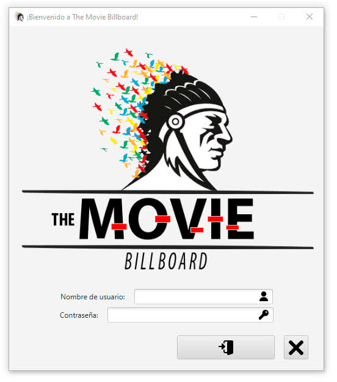
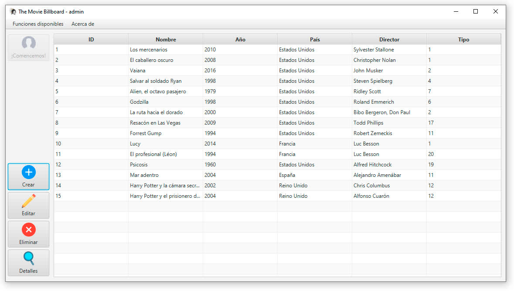

<strong>Aplicación de escritorio para la gestión de una BD de películas</strong>

# Introducción 🚀

**The Movie Billboard ©** parte con la idea de poder ayudar tanto a negocios como usuarios en la gestión y organización de películas en una aplicación de escritorio. Haciendo uso de la comodidad que tenemos trabajando en el ordenador no hay nada mejor que centralizar tus películas pendientes por ver o favoritas en una lista que podrás compartir mediante un archivo PDF. Se gestiona de manera muy sencilla y podrás gestionar una base de datos de manera segura. 

Esta idea parte de páginas como [FilmAffinity](https://www.filmaffinity.com/es/main.html) o la mundialmente conocida [IMDb](https://www.imdb.com), ambas con un catálogo muy extenso de películas, series y documentales que todo amante del cine consume.

## Instalación 📦

1. Vamos a la pestaña de ***Releases*** y descargamos la **última disponible**
2. Ejecutamos el **instalador**.
3. Seleccionamos un **idioma** y confirmamos.
4. Aceptamos el **acuerdo de licencia** y continuamos.
5. Marcamos la casilla de crear un **acceso directo** en el escritorio si así lo deseamos.
6. Pulsamos **instalar** y esperamos a que finalice.
7. Una vez que acabe, la aplicación **se abrirá automáticamente**.

## Construido con 🛠️

- [JavaFX Controls](https://mvnrepository.com/artifact/org.openjfx/javafx-controls) - Elementos, diseño y comportamientos
- [JavaFX FXML](https://mvnrepository.com/artifact/org.openjfx/javafx-fxml) - Creación de vistas
- [Apache Commons IO](https://mvnrepository.com/artifact/commons-io/commons-io) - Manejo de archivos tipo File
- [Apache Commons Codec](https://mvnrepository.com/artifact/commons-codec/commons-codec) - Tratamiento de los datos
- [SQLite JDBC Driver](https://github.com/xerial/sqlite-jdbc) - Funcionamiento de la Base de datos
- [JasperReports](https://mvnrepository.com/artifact/jasperreports/jasperreports) - Generar un archivo PDF
- [JavaPackager](https://github.com/fvarrui/JavaPackager) - Creador del instalador

## Wiki 📖

- Manual de usuario **(PRÓXIMAMENTE)**
- [JavaDoc](https://github.com/Ayoamaro/TheMovieBillboard/tree/main/docs/javadoc)

## Créditos ❤️

Agradecimientos a: [Freepik](https://www.flaticon.es/autores/freepik), [Pixel Perfect](https://www.flaticon.es/autores/pixel-perfect), [Smashicons](https://www.flaticon.es/autores/smashicons) & [DinosoftLabs](https://www.flaticon.es/autores/dinosoftlabs) por los iconos de la aplicación. El logotipo de la aplicación es propiedad de [Hugo Ranz Ramírez](https://www.domestika.org/fr/hugo_ranz)
